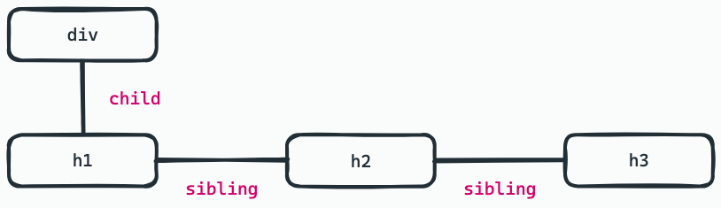
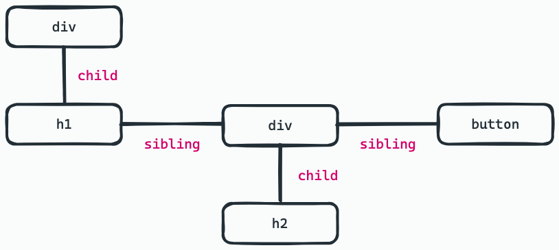
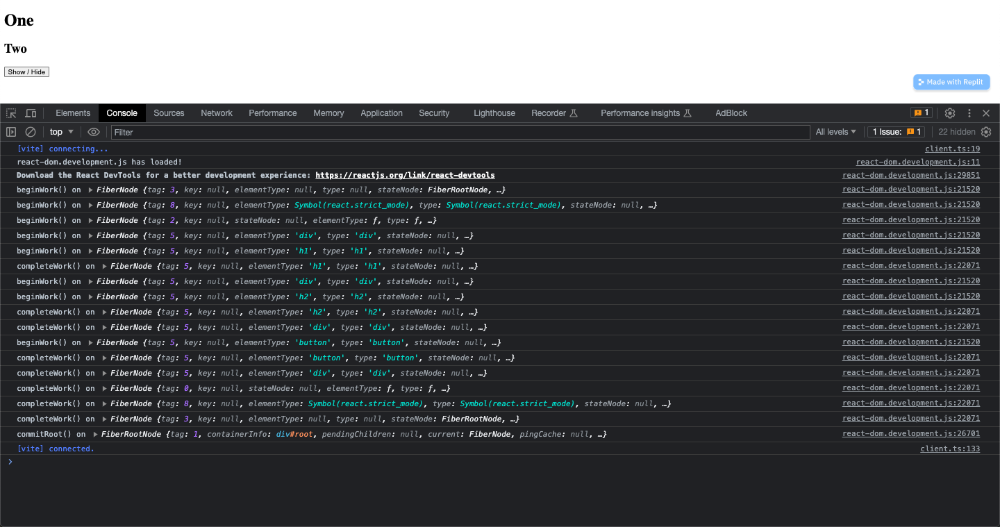
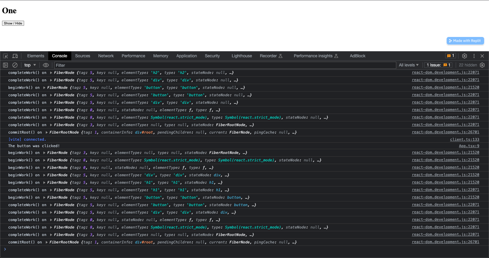

React Fiber is the new reconciliation algorithm that was introduced in React 16. It was implemented so that React could work better in terms of the animation and responsiveness of the application.

Compared to the reconciliation algorithm that was being used prior to React 16, React is now able to split work into chunks, and it can now prioritize tasks. Additionally, with the new Fiber Architecture, React is now able to pause work (and come back to it later), reuse previous work that had been done; or, abort ongoing work, if it is no longer needed.

## The Concept of Reconciliation

Reconciliation is _probably_ the biggest value that React brings.

### But, what exactly is reconciliation?

For React, **reconciliation** is the algorithm that it uses to diff one tree of elements from a previous tree, in order to determine which parts need to be changed.

The process of reconciliation is undertaken in order to _reconcile_ (or, adjust) your description of what you want the UI to look and behave like to the host environment (i.e., in this case, the web browser).

The JSX you've written describes the elements. And then, React — through the use of their reconciler — adapts those elements to the host environment.

## The Stack Reconciler

The previous version of the React reconciler was retroactively named the **Stack Reconciler**.

It was called as such because it worked (as you may have already guessed) like a stack. It worked with a last-in, first-out (LIFO) method, and it completed work synchronously.

The Stack Reconciler had to go through work one by one until the stack was empty. Tasks couldn't be interrupted.

Even though higher-priority tasks would enter the stack first (e.g., user events), they wouldn't be completed with speed if other, lower-priority tasks would enter the stack after them (e.g., fetching API data). So, as you may have expected, the Stack Reconciler proved to be a problem.

## The Fiber Reconciler

Enter the **Fiber Reconciler**! The Fiber Reconciler was built with a sense of priority. It is able to stop halfway through an update, should a higher-priority update enter the work loop. It can also do the higher-priority update off-screen, and then only put it on-screen once it has been completed.

The Fiber Reconciler improves the fundamental way in which React's works — but, that's not all! Since the Fiber Reconciler makes React faster and smarter, this improves the development of React, making it so that adding new features to the React library is easier.

## The Implementation of React Fiber

### So, what exactly is a "fiber"?

A **fiber** is actually just a plain JavaScript object with some properties. This object represents a unit of work.

Each "fiber" contains information about a component, its input, and its output. Let's take a look at some of these properties:

- **type**
  - this describes the component that a fiber corresponds to
  - for composite components, the `type` is the function or class component itself
  - for host components (e.g., `div`, `span`, etc.), the `type` is a string
- **key**
  - along with the `type`, the `key` property is used during reconciliation to see if the fiber can be reused or not
- **child**
  - the field points to the fiber that is the "first child" of a "parent" fiber
  - the child fibers form a singly-linked list whose "head" is the "first child"
- **sibling**
  - this field accounts for the case where `render()` returns multiple children
- **return**
  - this field points to the fiber to which the program should return to, after processing the current one
  - this `return` property can also be thought of as describing the "parent" fiber

```html
<div>
  <h1>One</h1>
  <h2>Two</h2>
  <h3>Three</h3>
</div>
```

If we create a tree of fibers for the code snippet above, the relationship would go as such:



- the **h1** fiber (as it is the first child) is the `child` of the **div** fiber
- the **h2** fiber is the `sibling` of **h1** fiber
- the **h3** fiber is the `sibling` of **h2** fiber
- the `return` of the **h1**, **h2**, and **h3** fibers is the **div** fiber

> **Fibers vs. React Elements**
>
> Much like a fiber, a React element is _also_ just a plain JavaScript object with some properties. Both even have the `type` and `key` properties. In addition to that, as much as a tree of fibers is created during the process of rendering in React, a tree of elements is also created.
>
> Actually, a fiber is usually created from an element — but, they are not exactly the same thing. While React elements are recreated each time, fibers are being reused as often as possible.

### How does React process these "fibers"?

React processes these "fibers" (i.e., these units of work), and then we end up with so-called "finished work". Afterwards, when the "finished work" is committed, it results in changes that are visible in the DOM.

If you recall, there are two (2) phases that React goes through in order to render the UI.

1. Render Phase (or, Processing Phase)
   - during this phase, React processes all the fibers, each of which can be prioritized, paused, or discarded altogether
   - `beginWork()` and `completeWork()` functions are called
   - React completes this phase **asynchronously**
2. Commit Phase (or, Committing Phase)
   - `commitRoot()` function is called
   - React completes this phase **synchronously**

## The Work Loop

Let's take a look at the work loop that React Fiber takes with an example.

Here is a very simple React app that shows and hides a `div` that has an `h2` nested inside it:

```jsx
// App.jsx

import { useState } from "react";
import "./App.css";

export default function App() {
  const [shown, setShown] = useState(true);

  const handleClick = () => {
    setShown(!shown);
    console.log("The button was clicked!");
  };

  return (
    <div>
      <h1>One</h1>
      {shown ? (
        <div>
          <h2>Two</h2>
        </div>
      ) : null}
      <button onClick={handleClick}>Show / Hide</button>
    </div>
  );
}
```

The equivalent tree of fibers for the code above may be represented as:



Now, to see what React Fiber does in the background, we need to take a look at the (usually hidden) files.

Let's navigate to **node_modules > react-dom > cjs > react-dom.development.js** and take a look at what React Fiber is doing behind the scenes.

In this file, we can see that the `workLoopSync()` function kicks off the work loop that we've been talking about. We can also see that the `workLoopSync()` function is being called to run as long as there is work that's in progress in our React application:

```js
// react-dom-development.js
...
...
  do {
    try {
      workLoopSync();
      break;
    } catch (thrownValue) {
      handleError(root, thrownValue);
    }
  } while (true);
...
...
function workLoopSync() {
  // Already timed out, so perform work without checking if we need to yield.
  while (workInProgress !== null) {
    performUnitOfWork(workInProgress);
  }
}
...
```

React Fiber actually maintains two (2) trees: the **current** tree, and the **workInProgress** tree.

The **current** tree is what is currently shown on the screen. It is where the **FiberRootNode** points to in the present time.

On the other hand, the **workInProgress** tree is the tree of fibers that React makes changes to off-screen. This is what is being referred to as the `workInProgress` variable in the code snippet above.

So, how these two (2) tree of fibers work together is that:

1. The **FiberRootNode** first points to the **current** tree upon initial render.
2. When there is work to be done after the initial render (e.g., after a change in state), this work is first processed on the **workInProgress** tree.
3. Then, once the work is complete and is done processing on the **workInProgress** tree, the **FiberRootNode** then switches to point to the **workInProgress** tree (which then, subsequently, becomes the **current** tree, and the former **current** tree then becomes the new **workInProgress** tree).

Let's attempt to visualize a little bit more the work loop that React Fiber takes. We can do this by logging into the console when exactly work begins and ends throughout the tree of fibers:

```js
// react-dom-development.js
...
...
function beginWork(current, workInProgress, renderLanes) {

	console.log("beginWork() on", workInProgress)

  {
    if (workInProgress._debugNeedsRemount && current !== null) {
      // This will restart the begin phase with a new fiber.
      return remountFiber(current, workInProgress, createFiberFromTypeAndProps(workInProgress.type, workInProgress.key, workInProgress.pendingProps, workInProgress._debugOwner || null, workInProgress.mode, workInProgress.lanes));
    }
  }

	...
	...

}
...
...
function completeWork(current, workInProgress, renderLanes) {

      console.log("completeWork()", workInProgress);

      var newProps = workInProgress.pendingProps; // Note: This intentionally doesn't check if we're hydrating because comparing
      // to the current tree provider fiber is just as fast and less error-prone.
      // Ideally we would have a special version of the work loop only
      // for hydration.

      popTreeContext(workInProgress);

      switch (workInProgress.tag) {
        case IndeterminateComponent:
        case LazyComponent:
        case SimpleMemoComponent:
				...
}
```

If we take a look at the console, this is what initially appears:



We can see that the `beginWork()` function first flows down the fiber tree, up until it finds the innermost child. And then, the `completeWork()` function flows upwards the fiber tree, up until it returns to the outermost **FiberRootNode**.



Now, when a re-render is triggered, we can see that the work loop basically just begins again!

We can actually also see when the commits to the actual DOM happens by logging into the console when the `commitRoot()` function is called:

```js
// react-dom-development.js
...
...
function commitRootImpl(root, recoverableErrors, transitions, renderPriorityLevel) {

  console.log("commitRoot() on", root);

  do {
    // `flushPassiveEffects` will call `flushSyncUpdateQueue` at the end, which
    // means `flushPassiveEffects` will sometimes result in additional
    // passive effects. So we need to keep flushing in a loop until there are
    // no more pending effects.
    // TODO: Might be better if `flushPassiveEffects` did not automatically
    // flush synchronous work at the end, to avoid factoring hazards like this.
    flushPassiveEffects();
  } while (rootWithPendingPassiveEffects !== null);
  ...
  ...
}
...
...
```

And in the console, we can see that the `commitRoot()` function is only called after all the work is done!
